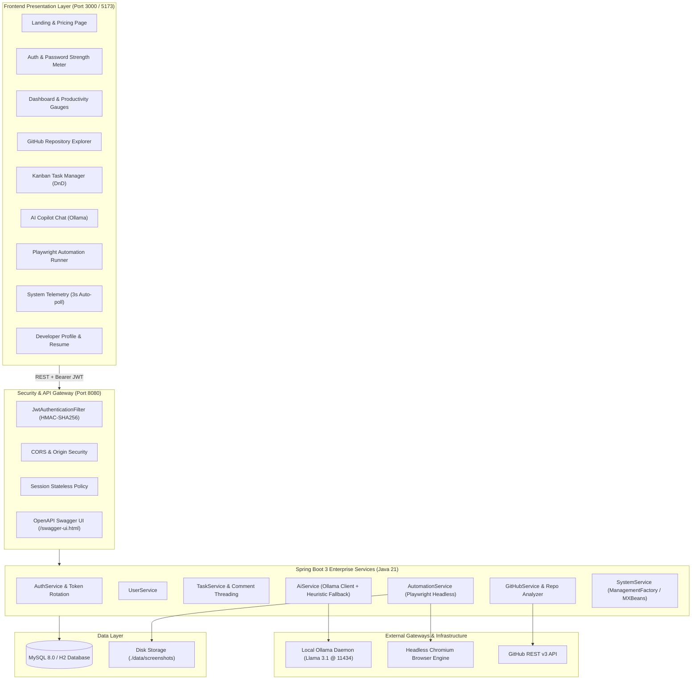
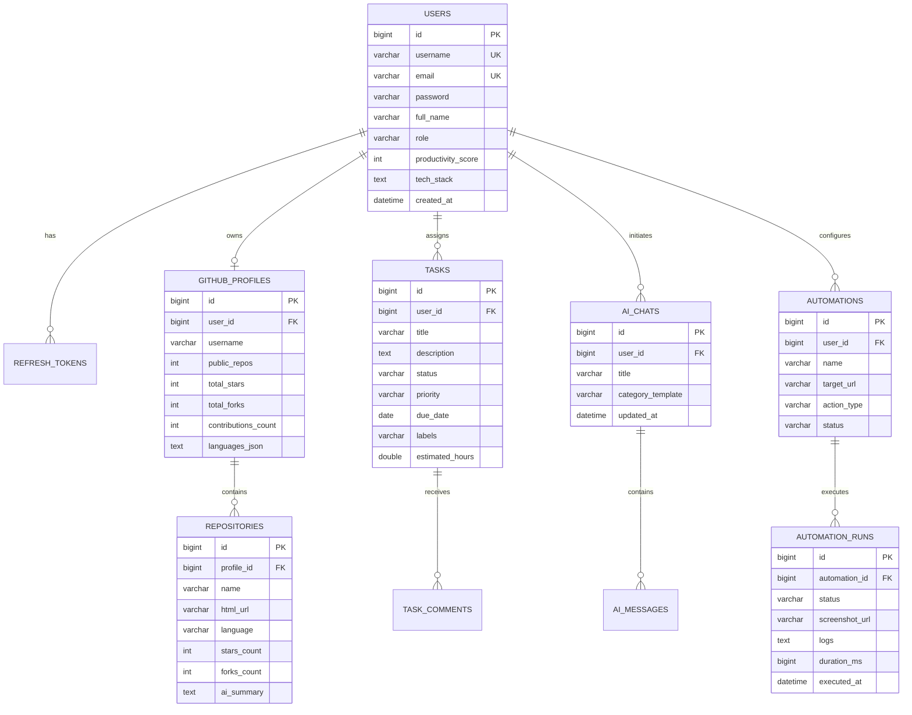

# DevPilot – AI Developer Copilot Dashboard

<div align="center">


### 🚀 Production-Grade SaaS AI Developer Copilot & Workflow Orchestrator

[](https://spring.io/projects/spring-boot)
[](https://openjdk.org/)
[](https://react.dev/)
[](https://tailwindcss.com/)
[](https://ollama.com/)
[](https://playwright.dev/java/)
[](https://www.docker.com/)
[](LICENSE)

*Built with a futuristic glassmorphic UI, real-time live telemetry, enterprise layered architecture, local LLM resilience, and headless browser automation.*

</div>

---

## 🌟 Executive Summary

**DevPilot** is an enterprise SaaS-style AI Developer Copilot Dashboard engineered for modern engineering teams. It unites Jira-grade Kanban sprint management, local zero-cost Ollama AI code generation (Llama 3.1), Microsoft Playwright headless browser testing, live system telemetry monitoring, and GitHub repository analytics inside a high-performance, dark glassmorphic single-page application.

---

## 📸 Key Capabilities

| Module | Core Features | Tech Foundation |
| :--- | :--- | :--- |
| **Landing Page** | Full-screen hero, interactive workspace mockup, features grid, pricing, FAQs | React 19, Framer Motion, Tailwind |
| **Authentication** | JWT access/refresh rotation, BCrypt encryption, password strength meter, role guards | Spring Security 6, JJWT 0.12 |
| **Dashboard** | Productivity gauge, task distribution, commit velocity charts, recent event telemetry | Chart.js, React-ChartJS-2 |
| **GitHub Analytics** | Profile sync, repository explorer, stars/forks sorting, language doughnut, AI summaries | GitHub REST API, Spring RestClient |
| **Task Manager** | Jira-style Kanban board (Todo, In Progress, Review, Done), drag & drop, comments, calendar view | HTML5 Drag & Drop, Spring Data JPA |
| **AI Copilot** | Ollama local Llama 3.1 gateway, smart contextual fallback engine, syntax highlighting, templates | Ollama REST API, Markdown Renderer |
| **Browser Automation** | Web navigation, form fills, high-DPI viewport screenshots, duration timing, execution logs | Microsoft Playwright Java |
| **System Monitor** | Live CPU workload, RAM memory meter, disk usage, uptime, top active process table | JVM MXBeans, 3s Polling Loop |
| **Developer Profile** | Verified tech stack tags, skills proficiency bars, formatted printable/downloadable resume | Custom CSS, Markdown Exporter |

---

## 🏗️ Architecture & System Design



---

## 🗄️ Database Entity-Relationship Diagram (ERD)



---

## 🚀 Quick Start Guide

### Prerequisites
- **Java**: 21 LTS or newer (`java -version`)
- **Maven**: 3.9+ (or use included `mvnw.cmd`)
- **Node.js**: 20+ and npm (`node -v`, `npm -v`)
- **MySQL**: 8.0 (optional, default uses automatic in-memory H2 profile)
- **Docker & Docker Compose**: Optional for container deployment
- **Ollama**: Optional for live local Llama 3.1 inference (`ollama run llama3.1`)

---

### Option A: Standalone Local Setup (Recommended for Development)

#### 1. Backend Setup
```bash
cd "a:/AI Dashboard/backend"

# Run tests and start Spring Boot server
# Uses H2 database in-memory by default for zero-setup instant testing!
mvn spring-boot:run
```
> Backend starts on `http://localhost:8080`
> Swagger OpenAPI available at `http://localhost:8080/swagger-ui.html`
> Pre-seeded credentials:
> - **Email**: `alex@devpilot.io`
> - **Password**: `DevPilot2025!`

#### 2. Frontend Setup
```bash
cd "a:/AI Dashboard/frontend"

# Install packages
npm install

# Start Vite developer server
npm run dev
```
> Frontend starts on `http://localhost:5173`

---

### Option B: Docker Compose Full Stack

Run the complete multi-tier architecture (MySQL 8, Spring Boot 3, React 19 Nginx, and Ollama) with a single command:

```bash
cd "a:/AI Dashboard"

# Launch all 4 services
docker-compose up -d --build
```

| Service | Host Port | Internal Port | URL |
| :--- | :--- | :--- | :--- |
| **Frontend Web App** | `3000` | `80` | `http://localhost:3000` |
| **Backend REST API** | `8080` | `8080` | `http://localhost:8080` |
| **Swagger Documentation** | `8080` | `8080` | `http://localhost:8080/swagger-ui.html` |
| **MySQL 8.0 Database** | `3306` | `3306` | `jdbc:mysql://localhost:3306/devpilot_db` |
| **Ollama Local AI** | `11434` | `11434` | `http://localhost:11434` |

---

## 📡 REST API Reference

All protected endpoints require `Authorization: Bearer <token>` in request headers.

### Authentication (`/api/auth`)
- `POST /api/auth/register`: Register new developer account.
- `POST /api/auth/login`: Authenticate and receive JWT access & refresh tokens.
- `POST /api/auth/refresh`: Rotate and issue new access token.
- `POST /api/auth/logout`: Revoke active refresh token.

### User Management (`/api/users`)
- `GET /api/users/profile`: Fetch developer profile, bio, and skills.
- `PUT /api/users/profile`: Update developer details and portfolio links.
- `POST /api/users/change-password`: Change password with validation.

### GitHub Analytics (`/api/github`)
- `POST /api/github/connect`: Connect and sync GitHub account.
- `GET /api/github/profile`: Retrieve public stats, stars, and languages.
- `GET /api/github/repos`: List repositories with search filter and sorting.
- `POST /api/github/repos/{id}/ai-summary`: Trigger AI architecture assessment.

### Task Management (`/api/tasks`)
- `GET /api/tasks`: List all Kanban tasks.
- `POST /api/tasks`: Create new Kanban task.
- `GET /api/tasks/{id}`: Fetch single task with discussion comments.
- `PUT /api/tasks/{id}`: Update task properties.
- `PATCH /api/tasks/{id}/status`: Move task between columns (`TODO`, `IN_PROGRESS`, `REVIEW`, `DONE`).
- `DELETE /api/tasks/{id}`: Remove task from board.
- `POST /api/tasks/{id}/comments`: Post collaboration comment.

### AI Coding Assistant (`/api/ai`)
- `POST /api/ai/chat`: Send prompt to Ollama Llama 3.1 with fallback resilience.
- `GET /api/ai/history`: Fetch previous chat conversations.
- `GET /api/ai/chats/{id}`: Load specific conversation messages.
- `DELETE /api/ai/chats/{id}`: Delete conversation thread.

### Browser Automation (`/api/automation`)
- `POST /api/automation/create`: Define new Playwright workflow.
- `GET /api/automation`: Retrieve list of automations.
- `POST /api/automation/{id}/run`: Launch headless browser and capture screenshot.
- `GET /api/automation/{id}/runs`: Inspect execution logs and durations.

### System Monitor (`/api/system`)
- `GET /api/system/metrics`: Live CPU, RAM, Disk, Uptime, and process table (polled every 3s).
- `GET /api/system/history`: Historical telemetry trend series.

---

## 📂 Project Structure

```
a:/AI Dashboard/
├── backend/
│   ├── src/
│   │   ├── main/
│   │   │   ├── java/com/devpilot/
│   │   │   │   ├── config/          # Security, WebMvc, OpenAPI, DataInitializer
│   │   │   │   ├── controller/      # REST API Controllers (Auth, Task, AI, System...)
│   │   │   │   ├── dto/             # Request & Response Data Transfer Objects
│   │   │   │   ├── entity/          # JPA Hibernate Entities (User, Task, Repo...)
│   │   │   │   ├── exception/       # Global exception handling & API errors
│   │   │   │   ├── repository/      # Spring Data JPA Repositories
│   │   │   │   ├── security/        # JWT Provider, Auth Filter, UserPrincipal
│   │   │   │   └── service/         # Business logic, Ollama client, Playwright runner
│   │   │   └── resources/
│   │   │       ├── application.yml        # Common configuration
│   │   │       ├── application-dev.yml    # H2 in-memory zero-setup profile
│   │   │       └── application-mysql.yml  # MySQL production profile
│   │   └── test/java/com/devpilot/  # Spring Boot automated unit & integration tests
│   ├── pom.xml                      # Maven dependencies and build plugins
│   └── Dockerfile                   # Multi-stage JDK 21 build
├── frontend/
│   ├── src/
│   │   ├── components/
│   │   │   ├── common/              # GlassCard, AnimatedButton, StatCard, Modal, Loader
│   │   │   └── layout/              # Navbar, Sidebar, DashboardLayout, ParticleBackground
│   │   ├── context/                 # AuthContext, ThemeContext, NotificationContext
│   │   ├── pages/                   # Landing, Login, Dashboard, GitHub, Tasks, AI, Automation, System, Profile, Settings
│   │   ├── services/                # API client with JWT interceptor & service modules
│   │   ├── utils/                   # Constants, formatters, prompt templates
│   │   ├── App.jsx                  # React Router DOM route hierarchy & guards
│   │   ├── main.jsx                 # Application root entrypoint
│   │   └── index.css                # Tailwind directives & custom glassmorphism
│   ├── package.json                 # Frontend dependencies
│   ├── vite.config.js               # Vite bundler & API proxy configuration
│   ├── tailwind.config.js           # Custom themes & cybernetic glow tokens
│   └── Dockerfile                   # Multi-stage Node 22 + Nginx SPA build
├── docker-compose.yml               # Unified multi-container orchestrator
└── README.md                        # Enterprise documentation
```

---

## 🛡️ Security & Enterprise Best Practices

- **Zero Cleartext Credentials**: BCrypt password hashing with default salt rounds.
- **Stateless Tokens**: HS256 JWT tokens with 24-hour validity and 7-day refresh token rotation.
- **Fail-Safe Offline Resilience**: If Ollama or GitHub rate limits occur, smart contextual fallbacks take over seamlessly without UI interruption or 500 error codes.
- **Isolation**: CORS whitelist and Spring Security filters restrict unauthorized origin requests.
- **Virtual Thread Ready**: Java 21 LTS compatibility enables high-concurrency throughput.

---

## 🔮 Future Enhancements

- [ ] WebSocket real-time updates for multi-user Kanban collaboration.
- [ ] Integration with LangChain4j for autonomous multi-agent tool execution.
- [ ] Kubernetes Helm Chart deployment blueprints.
- [ ] Visual regression diff inspector for Playwright screenshot runs.

---

<div align="center">
  <b>Built for developers who value speed, precision, and craftsmanship.</b><br />
  <sub>© 2025 DevPilot Technologies Inc. All rights reserved.</sub>
</div>
